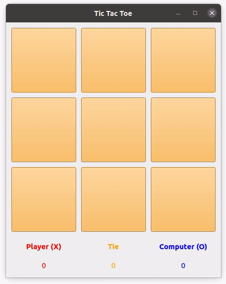

   

# Tic Tac Toe

A simple Tic Tac Toe game written in Qt for fun.

## Development environment

* Qt Creator 6.0.2 based on Qt 6.2.2
* Windows 10

## TODO

* Update gif on Readme
* Add 5x5 and 7x7 boards
  * Improve minimax algorithm with alpha beta pruning
* ~~Game difficulty option~~
  * ~~Implement minimax algorithm~~
* Add Sound effects
  * when clicked
  * After game finished
* Animation
  * After clicked
  * After game finished
* Toolbar
  * ~~Reset score~~
  * Mute sound
* Menubar
  * About section
  * ~~Settings section~~
* Add unit tests
* Add automated GUI testing with Squish
* ~~Add code coverage report~~
* ~~Add automatic build~~

## License

This project is licensed under the terms of the  [MIT License](https://choosealicense.com/licenses/mit/)

Copyright © 2022 M. Serdar Karaman
